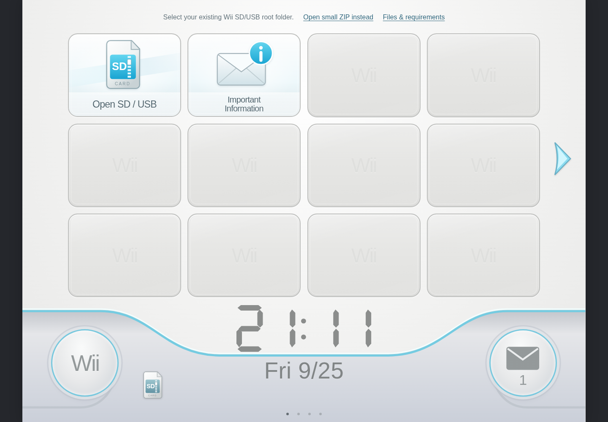

# Wii Game Manager · v3.0.0

A Wii-menu-style website for managing **an existing homebrew Wii SD/USB card or its backup folder**. It is a file manager, not an emulator, homebrew installer, game downloader, or channel installer.

**Main workflow: Open SD / USB → review the library → stage edits → Apply changes.** Existing games are inventoried by file name, size and handle; their contents are not loaded into RAM just to list them. New game files are copied in bounded 4 MiB chunks with a read-back integrity check. Folder mode has **no combined 4 GiB archive cap**.

The earlier small-ZIP editor is retained as a fallback, not the way to manage a whole game collection. There is **no Start empty library / blank-card setup feature**. A card that already has apps or loader folders but no games is still usable.



## Use the published website

Expected project address: **https://sjoeen.github.io/wii-game-manager/**. This package does not publish itself or change any GitHub account. See [START-HERE.md](START-HERE.md) to publish/update it.

Use the top-level HTTPS page in a browser exposing `showDirectoryPicker`, writable file handles and Web Locks, such as a current desktop Chrome or Edge. Not every browser or preview supports these APIs. The page checks capabilities and offers small-ZIP fallback when direct access is unavailable. Browser policies, private modes, protected locations and removable-device access may impose additional restrictions.

1. Back up your card. For a first trial, **select a copy of the card in a normal computer folder**, not the only copy.
2. Click **Open SD / USB**. Select the card root or the backup folder containing `apps`, `wbfs`, or related Wii folders. Initially only reading is requested.
3. Use **Games**, **ROM Hacks**, or **All Files**. Games are displayed in a separate library screen, not in the empty home-menu channels.
4. Add games or stage removals. **Undo** reverses the last pending edit. **Discard staged** discards the plan. Neither changes disk files.
5. Click **Apply changes**, review relative paths, acknowledge permanent removals, and click **Apply to selected folder**. Allow the browser's write permission request. Keep the drive connected and the tab open until the operation report appears.

**Applied removals are permanent.** This app is not a replacement for a separate backup. A durable journal supports recovery, but multi-file changes cannot be made completely atomic in a browser. See [Safety and recovery](docs/SAFETY-AND-RECOVERY.md).

## Inputs and limits

| Input | What it accepts | Important limits |
| --- | --- | --- |
| Open SD / USB | Existing Wii card root / computer backup folder | Reads metadata; no combined ZIP cap. It does not verify that console-side homebrew is installed. |
| Add game | Wii `.wbfs` / `.iso`; all matching `.wbf1`, `.wbf2`, etc. together | Writes use FAT32-safe per-file limits. Oversized WBFS is split into at most 2 GiB parts; oversized ISO requires proper conversion outside the app. |
| Add ROM hack | SD-ready mod ZIP with its complete destination layout | In folder mode: maximum 256 MiB compressed input **and** uncompressed content. Raw patches are not applied. |
| Open small ZIP instead | ZIP of an existing Wii card layout | Below about 4 GiB combined; RAM may be exhausted earlier. Export makes a new ZIP, not disk edits. |

The FAT32-safe write policy is deliberately conservative even when the selected computer/USB folder uses another filesystem. There is no filesystem auto-detection or format tool. Existing larger files can be listed, but new oversized ISOs are not accepted in this mode. Settings, saves, GameCube files, emulator ROMs and unrelated files are left alone unless a reviewed mod package explicitly replaces a path. Detection is not universal support for every Wii mod format.

Only a main Wii game file and its matching split companions are removed by a game card. Neighboring notes, saves and unrelated files remain. A tracked ROM-hack package records original files in manager-owned backups for later restoration. Untracked Riivolution detection is conservative and cannot guarantee removal of all external assets.

See the complete [file requirements](UPLOAD-GUIDE.md) and [user guide](docs/USER-GUIDE.md).

## Publish to GitHub Pages

Repository: **`wii-game-manager`**, not `sjoeen.github.io`.

Upload the contents of this repository folder with **`index.html` at the repository root**, including `.nojekyll`. In **Settings → Pages**, choose **Deploy from a branch → main → /(root)**. No build step, backend, API key or runtime download is required. The included workflow checks code; it does not deploy Pages. [Deployment details](docs/DEPLOYMENT.md).

## Develop and test

```sh
npm run verify        # deterministic build check + Node/model/static HTTP tests
npm run build         # regenerate index.html, offline copy, dev.html and guide
npm run start:pages   # local preview at http://127.0.0.1:8080/wii-game-manager/
npm run test:faults   # simulated disconnections at 147 mutation boundaries
```

Optional browser and real-large-file suites:

```sh
python -m pip install -r requirements-test.txt
python -m playwright install chromium
npm run test:browser
npm run test:launch
npm run test:large    # needs roughly 8 GiB temporary disk space; not for an SD card
```

No npm package installation is needed for building or Node tests. `index.html` is self-contained; `Wii-SD-Manager.html` is an identical portable copy. For reliable native folder access, use the published HTTPS page or localhost rather than an embedded preview. `dev.html` uses relative JS modules on a local server.

The [test report](TEST-REPORT.md) distinguishes **real disk copies**, **browser UI tests with simulated folder APIs**, and **native picker / hardware checks that were not available**. It does not claim validation on a physical Wii or SD card.

## Repository map

- `template.html`, `styles.css`, `app.js`: interface and orchestration.
- `core.js`: paths, detection, manifest validation and shared helpers.
- `folder-model.js`, `disk-io.js`: lazy file handles, staged plan, bounded copies and journal recovery.
- `model.js`: legacy in-memory ZIP model; `vendor/`: bundled JSZip and notices.
- `upload-specs.js`: shared in-app help and generated upload guide.
- `test/`: regression, UI, fault-injection and real disk adapters/tests.
- `docs/`: setup, developer, safety and verification documentation.
- `demo/`: **non-playable** synthetic fixtures. Never copy them to a Wii as games.

No games, Wii firmware, console fonts, original channel art, sound effects, analytics or upload endpoint are included. Do not commit personal games, SD backups, saves or credentials to this public repository. See [privacy](PRIVACY.md), [security](SECURITY.md) and [licensing](LICENSING.md).
